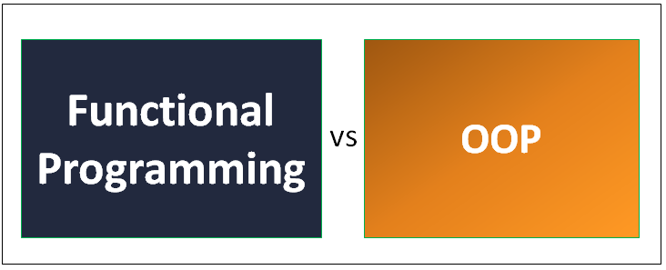

# Paradigm Discussion - Functional versus Object-Oriented Programming



First, let's talk about the elephant in the room: I'm inclined to think when it comes to building modern backends, especially highly concurrent, and distributed systems, you want to stick to functional programming concepts.  This was why I settled on TypeScript, Rust, and Go for the [backends comparison discussion](./the-case-for-go-backends.md).  I'm not saying that you can't build a highly concurrent and distributed system with C#, Java, or Python, but I think you'll have an easier time with TypeScript, Rust, and Go.  While the latter languages mentioned aren't strict functional languages, these languages are well-suited to building backend systems that require high availability and fault tolerance.  

In distributed, serverless applications, where the system may be composed of multiple processes or functions running on different machines, the potential for concurrency issues is even greater. This is because each process or function may be running independently and concurrently, with the potential for shared data or resources. In this context, functional programming can be particularly useful for reducing the complexity of concurrent and distributed systems, by emphasizing immutability and pure functions that avoid shared state and side effects.

## Functional Programming

Functional programming emphasizes immutability, pure functions, and higher-order functions, which can lead to code that is easier to reason about, test, and parallelize. Functional programming is also well-suited for applications that deal with large amounts of data, such as data analysis, machine learning, and scientific computing. However, functional programming can have a steeper learning curve, and some developers may find it more difficult to write and maintain functional code compared to object-oriented code.  There are 3 key tenets of functional programming:

- **Immutability**: Immutable data cannot be changed after it is created. This makes it easier to reason about the state of a program, and it can also lead to better performance because the compiler can optimize away unnecessary copies of data.
- **Pure functions**: A pure function is a function that has no side effects and always returns the same output given the same input. Pure functions are easier to reason about and test, and they can be easily parallelized.
- **Higher-order functions**: A higher-order function is a function that takes a function as an argument or returns a function as a result. Higher-order functions can be used to abstract common patterns, which can lead to more modular and reusable code.

It's easy to see how these tenets can lead to code that is easier to reason about, test, and parallelize.  For example, consider the following code:

```javascript
const numbers = [1, 2, 3, 4, 5];
const doubled = numbers.map((number) => number * 2);
console.log(doubled);
```

This code uses the `map` function to double each number in the array. The `map` function takes a function as an argument, and it returns a new array containing the results of calling the function on each element in the original array. In this case, the function passed to `map` is a pure function that doubles its argument. This code is easy to reason about because it's clear that the `doubled` array contains the same number of elements as the `numbers` array, and it's also clear that the elements in the `doubled` array are twice as large as the elements in the `numbers` array.

## Object-Oriented Programming (OOP)

OOP concepts can cause problems in highly concurrent and distributed systems because of its general reliance on mutable state and shared data. In a concurrent system, multiple threads or processes may need to access and modify the same data simultaneously, which can lead to race conditions, deadlocks, and other types of synchronization issues.  This is not to say that OOP is inherently bad or unsuitable, but focusing on immutability and pure functions will mitigate the aforementioned issues.

While OOP has its perks, like modularity, reusability, and extensibility, it can also lead to tightly coupled code, which makes it harder to understand how the entire system behaves compared to functional programming.  The 3 key tenets of object-oriented programming are:

- **Encapsulation**: Encapsulation is the process of hiding the implementation details of a class from the rest of the program. This makes it easier to change the implementation of a class without breaking other parts of the program that depend on that class.
- **Inheritance**: Inheritance is the process of creating a new class from an existing class. The new class inherits the behavior of the existing class, and it can also add new behavior. Inheritance can be used to reduce duplication in a program by sharing behavior across multiple classes.
- **Polymorphism**: Polymorphism is the process of reusing the same interface for multiple types. This can lead to more modular and reusable code because a function can operate on different types of data as long as they all implement the same interface.

## In Defense of C#, Java, and Python

Although languages such as C#, Java, and Python were not considered for the aforementioned [backends comparison discussion](./the-case-for-go-backends.md), they are widely used for building backend systems.  Also, they do offer some support for functional programming concepts.

A particular language I want to avoid completely shitting on is Python.  It has several libraries and tools that enable concurrent and asynchronous programming. Additionally, it offers multiprocessing support, which can be useful for distributed applications. While Python is not as low-level as Rust or as explicitly designed for concurrency as Go, it's still a viable choice for many distributed systems, particularly when ease of development and code readability are essential.  Python is interpreted, so it's very slow.  However, with the use of [ctypes](https://docs.python.org/3/library/ctypes.html), you can call C code from Python, which can help mitigate the performance issues.  For example, a good use-case would be [AWS IoT Greengrass](https://docs.aws.amazon.com/greengrass/v1/developerguide/IoT-SDK.html), where you can write your business logic in Python, and then call C code for the performance critical parts.

In addition (more self rebuttal), usage of a C# framework like [ASP .NET Core](https://dotnet.microsoft.com/en-us/learn/aspnet/what-is-aspnet-core) or a Java framework like [OfficeFloor](https://officefloor.net/tutorials/index.html) are more than capable in the right hands.

## Other languages not considered - Ruby and Elixir

While Ruby and Elixir are both powerful languages that are well-suited for building highly concurrent and distributed systems, they do have some potential drawbacks that keeps them from moving the needle for me.

One potential disadvantage of Ruby is its runtime performance. Ruby is an interpreted language, which can make it slower than compiled languages like C++ or Rust. Additionally, Ruby's garbage collector can sometimes cause performance issues, especially in large-scale systems. While Ruby has a large ecosystem of libraries and frameworks, it may not have the same level of support for building highly concurrent and distributed systems as other languages like Elixir.  A very timely article titled ["Whatever Happened to Ruby?"](https://www.infoworld.com/article/3687219/whatever-happened-to-ruby.html) was published when I started writing this document, and it provides a good overview of the current state of Ruby.

Elixir, on the other hand, is a relatively new language, and it may not have the same level of community support as more established languages. Additionally, while Elixir provides excellent support for concurrency, it may not be as well-suited for building systems that require a lot of mutable state. Finally, while Elixir runs on the Erlang virtual machine, which provides excellent support for fault tolerance and distributed computing, it may not have the same level of support for low-level systems programming as other languages like Rust.  Elixir has a different syntax and programming paradigm than many other popular languages, which can make it challenging for developers who are not familiar with functional programming to learn.  Still, if you want to learn more about the pros and cons of Elixir, I recommend reading this article titled ["The Pros & Cons of Elixir Programming Language"](https://www.rswebsols.com/tutorials/programming/pros-cons-elixir-programming-language).
