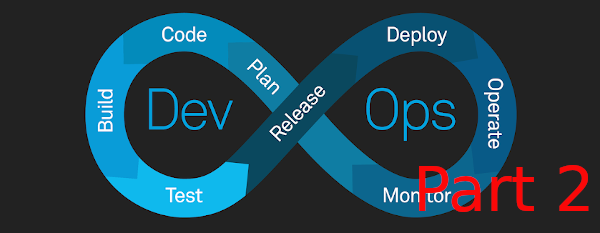

# Further Improving the Developer Experience with Argo CD and GitHub Actions



Argo CD is a declarative, GitOps continuous delivery tool for Kubernetes. With Argo CD, you can define your application deployment as a code, store it in a Git repository and use Argo CD to keep the deployed application in sync with the state specified in the Git repository.  Your GitHub repository is the source of truth for your application deployment. Argo CD continuously monitors your Git repository and automatically deploys your application whenever a change is detected.  The flow looks like this:

---> Merge PR Request ---> Image Tag/Push to Registry
**Developer**
-------------------------> Argo Sync ---> Argo CD ---> Kubernetes Cluster

If that wasn't clear:  the developer initiates both actions concurrently.

## Prerequisites

[Improving the Development Experience with Loft & DevSpace](./improving-the-dev-exp.md) - Completion of this previous tutorial is the base for this Argo CD tutorial.  The previous tutorial gets us acclimated with: [Amazon Elastic Kubernetes Service](https://aws.amazon.com/eks/), the [AWS CLI](https://docs.aws.amazon.com/cli/latest/userguide/install-cliv2.html), the [`eksctl`](https://docs.aws.amazon.com/eks/latest/userguide/eksctl.html) tool, the [`kubectl`](https://kubernetes.io/docs/tasks/tools/install-kubectl/) command, [Helm](https://helm.sh), [DevSpace](https://devspace.sh), and [Docker](https://docs.docker.com/get-docker/).

First things first, let's create an `ecr_deployer` user we'll need for some GitHub repositories we'll create later.  We'll do this now because we'll need to use the `eks_admin` account for the rest of this tutorial afterwards.

```bash
AWS_ACCOUNT_ID=$(aws sts get-caller-identity --query Account --output text)
aws iam create-user --user-name ecr-deployer

echo '{
"Version": "2012-10-17",
"Statement": [
    {
        "Effect": "Allow",
        "Action": [
            "ecr:*"
        ],
        "Resource": "*"
    }
]
}' >| ecr-policy.json

aws iam create-policy \
    --policy-name ecr-policy \
    --policy-document file://ecr-policy.json

aws iam attach-user-policy --user-name ecr-deployer --policy-arn arn:aws:iam::$AWS_ACCOUNT_ID:policy/ecr-policy

# THE following will create credentials for the ecr-deployer user we created in the previous step.
# We'll store these credentials in a file called `ecr-creds` for reference later.
echo "DEPLOYER_CREDS=$(aws iam create-access-key --user-name ecr-deployer --query 'AccessKey.{AccessKeyId:AccessKeyId,SecretAccessKey:SecretAccessKey}' --output text)" >| ecr-creds.sh
```

Building off the previous tutorial, we'll assume the `eks-cluster-role` for the `eks-admin` credentials. Both were created in the previous tutorial:

```bash
AWS_ACCOUNT_ID=$(aws sts get-caller-identity --query Account --output text)
TEMP_CREDS=$(aws sts assume-role \
    --role-arn arn:aws:iam::$AWS_ACCOUNT_ID:role/eks-cluster-role \
    --duration-seconds 3600 \
    --role-session-name cluster-60-minute-session \
    --profile eks-admin)

# REMINDER: these credentials will persist in your shell environment for the duration of the session
# You can unset them by running the following commands: unset AWS_ACCESS_KEY_ID AWS_SECRET_ACCESS_KEY AWS_SESSION_TOKEN.
# Otherwise, your default and other profiles will not work until you restart your shell.
export AWS_ACCESS_KEY_ID=$(echo $TEMP_CREDS | jq -r '.Credentials.AccessKeyId')
export AWS_SECRET_ACCESS_KEY=$(echo $TEMP_CREDS | jq -r '.Credentials.SecretAccessKey')
export AWS_SESSION_TOKEN=$(echo $TEMP_CREDS | jq -r '.Credentials.SessionToken')
```

## Install Argo CD

We can install Argo CD using the Helm chart provided by the Argo CD team.  Unlike how we worked with Loft in the last tutorial, we will expose to the Internet using a **LoadBalancer** service.  This is because we will need to access Argo CD from our GitHub Actions workflow.

```bash
helm repo add argo https://argoproj.github.io/argo-helm
helm repo update

aws eks update-kubeconfig --name development

# Using our root accout's profile we'll need to set the eks-admin credentials to create an IAM identity mapping for the eks-cluster-role
eksctl create iamidentitymapping \
    --cluster development \
    --arn arn:aws:iam::$AWS_ACCOUNT_ID:role/eks-cluster-role \
    --username eks-admin \
    --group system:masters \
    --region us-east-2 \
    --profile default

kubectl create namespace argo-cd          # create namespace in cluster
helm install argo-cd argo/argo-cd --namespace argo-cd --set server.service.type=LoadBalancer
ARGO_SERVER=$(kubectl get service argo-cd-argocd-server -o jsonpath='{.status.loadBalancer.ingress[0].hostname}' --namespace argo-cd)
```

Now that we've installed Argo CD in the **argo-cd** namespace, we can access the Argo CD UI at whatever is stored in the `ARGOCD_SERVER` environment variable.  The default username and password is `admin`, but to get the default password, you'll need to execute the following:

```bash
ARGO_PASSWORD=$(kubectl get secret argocd-initial-admin-secret -o jsonpath="{.data.password}" --namespace argo-cd | base64 -d)
```

For this tutorial, I suggest you change the default password at `$ARGOCD_SERVER/user-info?changePassword=true`.  Afterwards, set the `ARGO_PASSWORD` environment variable to the new password.

```bash
export ARGO_PASSWORD="<your new password>""
```

## Helm Charts Repository

As mentioned in the "Improving the Development Experience with Loft & DevSpace" article, I advise just creating a centralized repository for our Helm charts. For this tutorial, we'll use a Git repository to store our Helm charts.  We'll also use GitHub Actions to automatically build and push our Docker images to [Amazon Container Registry](https://aws.amazon.com/ecr/), and we'll use Argo CD to deploy our application to our Kubernetes cluster.  The Kubernetes cluster can be a local cluster, such as Kind, or a remote cluster, such as Amazon Kubernetes Services.  For this tutorial, we'll use Kind.

## Create Repositories for the Tutorial

Let's create the repository for our Helm charts.  Let's re-brand as `Acme Technologies` for this example.

```bash
mkdir acme-organization && cd $_
```

We will create a repository for our Helm charts.  Helm charts:

```bash

mkdir helm-deployments && cd $_
echo "# Helm Deployments" >| README.md

wget -O .gitignore https://raw.githubusercontent.com/github/gitignore/main/Node.gitignore
echo '.env' >| .dockerignore

git init . && git add .
git commit -m "Initial commit"
```

For our upcoming 2 example applications, we'll eventually create Helm charts for them in the `helm-deployments`repository later.

To avoid repeating ourselves, let's create both examples, their Docker images, and ECR repositories in one script.  This will work on Linux, Mac, and WSL.  If you're doing this in Powershell, this should be self-explanatory enough for you to follow along.

```bash
# While still inside the root "acme-organization" folder,
# let's create the repositories for 2 example applications.
# We won't create the apps in this root, but we need to start this script there.
# At the end of this script, you will see 3 folders inside the ace-organization folder:
# 1. helm-deployments, 2. example-1, and 3. example-2
# NOTE:  The 2 example repos can be public, but the helm-deployments repo will need to be private.

AWS_ACCOUNT_ID=$(aws sts get-caller-identity --query Account --output text)
REPOSITORY_PATH=$AWS_ACCOUNT_ID.dkr.ecr.us-east-2.amazonaws.com

aws ecr get-login-password | docker login --username AWS --password-stdin $REPOSITORY_PATH

for i in {1..2}
do
    cd ..
    mkdir example-$i && cd $_
    mkdir -p .github/workflows

    echo "name: Build and Push to ECR
on:
  push:
    branches:
      - main
jobs:
  login-build-and-push-to-ecr:
    runs-on: ubuntu-20.04
    steps:
      - id: configure-credentials
        uses: aws-actions/configure-aws-credentials@v1
        with:
          aws-access-key-id: \${{ secrets.AWS_ACCESS_KEY_ID }}
          aws-secret-access-key: \${{ secrets.AWS_SECRET_ACCESS_KEY }}
          aws-region: us-east-2
      - id: login-to-ecr
        uses: aws-actions/amazon-ecr-login@v1
      - id: checkout
        uses: actions/checkout@v2
      - id: build-and-push-to-ecr
        run: |
          docker build -t example-1:latest .
          docker tag example-$i:latest \${{ secrets.REPOSITORY_PATH }}/example-$i:latest
          docker push \${{ secrets.REPOSITORY_PATH }}/example-$i:latest
        env:
          ECR_REGISTRY: \${{ steps.login-to-ecr.outputs.registry }}
      - id: download-argo-cd-cli
        uses: clowdhaus/argo-cd-action/@main
        env:
          # Only required for first step in job where API is called
          # All subsequent setps in a job will not re-download the CLI
          GITHUB_TOKEN: \${{ secrets.GITHUB_TOKEN }}
        with:
          command: version
          options: --client
      - id: login-to-argo-cd
        uses: clowdhaus/argo-cd-action/@main
        with:
          command: login
          options: --username \${{ secrets.ARGO_USERNAME }} --password \${{ secrets.ARGO_PASSWORD }} --insecure \${{ secrets.ARGO_SERVER }}
      - id: trigger-restart-of-deployment
        uses: clowdhaus/argo-cd-action/@main
        with:
          command: app actions run example-$i restart
          options: --kind Deployment
      - id: trigger-sync
        uses: clowdhaus/argo-cd-action/@main
        with:
          command: app sync example-$i
          options: --force" >| .github/workflows/build_and_push.yml

        echo "const http = require('http');
const port = 300$i;

const server = http.createServer((req, res) => {
    res.statusCode = 200;
    res.setHeader('Content-Type', 'text/plain');
    res.end('Example-$i Application - Hello, world!\n');
});

server.listen(port, hostname, () => {
console.log(\`Server running at http://localhost:\${port}/\`);
});" >| app.js

        echo "FROM node:18-alpine
WORKDIR /app
COPY . .
EXPOSE 300$i
CMD [ "node", "app.js" ]" >| Dockerfile

    echo "# Example $i" >> README.md
    git init . && git add .
    git commit -m "Initial commit"

    aws ecr create-repository --repository-name example-$i
    
    docker build -t example-$i:latest .
    docker tag example-$i:latest $REPOSITORY_PATH/example-$i:latest
    docker push $REPOSITORY_PATH/example-$i:latest
done
```

Afterward, push both examples and the Helm charts repository to [GitHub](https://docs.github.com/en/get-started/importing-your-projects-to-github/importing-source-code-to-github/adding-locally-hosted-code-to-github). These steps will need to occur on GitHub.

### Create GitHub Actions Secrets

Now we'll create the secrets for our GitHub Actions. We can do this programaticaly using a GitHub PAT (personal access token) and GitHub's CLI, but we'll do this in the [GitHub UI](https://docs.github.com/en/codespaces/managing-codespaces-for-your-organization/managing-encrypted-secrets-for-your-repository-and-organization-for-github-codespaces)  for brevity. Create the following secrets using the values displayed from the following commands:

```bash
echo ARGO_PASSWORD=$ARGO_PASSWORD
echo ARGO_SERVER=$ARGO_SERVER
echo ARGO_USERNAME=admin      # This is the default username for Argo CD but of course we can change it.

# THE following will create credentials for the ecr-deployer user we created in the previous step.
DEPLOYER_CREDS=$(aws iam create-access-key --user-name ecr-deployer --query 'AccessKey.{AccessKeyId:AccessKeyId,SecretAccessKey:SecretAccessKey}' --output text)
echo AWS_ACCESS_KEY_ID=$(echo $DEPLOYER_CREDS| awk '{print $1}')
echo AWS_SECRET_ACCESS_KEY=$(echo $DEPLOYER_CREDS| awk '{print $2}')

AWS_ACCOUNT_ID=$(aws sts get-caller-identity --query Account --output text)
REPOSITORY_PATH=$AWS_ACCOUNT_ID.dkr.ecr.us-east-2.amazonaws.com
```

We'll only need to create these secrets for the *example-1* and *example-2* repositories.

## Getting Started with ArgoCD

The [Argo CD CLI](https://argo-cd.readthedocs.io/en/stable/cli_installation/) will need to be installed at this point.  To do so, executed `argocd login --username admin --password $ARGO_PASSWORD --insecure $ARGO_SERVER`.

The end-goal is to deploy to our Kubernetes cluster when new images are pushed to AWS ECR.  We'll need to deploy to Kubernetes first and then subsequently create apps in Argo CD.  To baseline both, we can achieve this by utilizing Helm charts. Change your current directory to the `helm-deployments` repository and execute the following commands:

```bash
for i in {1..2}
do 
    helm create example-$i
    sed -i "s/repository: nginx/repository: $REPOSITORY_PATH\/example-$i/g" example-$i/values.yaml
    sed -i "s/tag: \"\"/tag: \"latest\"/g" example-$i/values.yaml
    sed -i "s/port: 80/port: 300$i/g" example-$i/values.yaml
    sed -i "nameOverride: \"\"\/nameOverride: \"example-$i-app\"/g" example-$i/values.yaml
    sed -i "fullnameOverride: \"\"\/fullnameOverride: \"example-$i-chart\"/g" example-$i/values.yaml
    sed -i "name: \"\"\/name: \"example-$i\"/g" example-$i/values.yaml

    # Replace the deployment.yml file with the following:
    # Note:  "imagePullPolicy: Always" is required for ArgoCD to pull the latest image from ECR
    echo "apiVersion: apps/v1
kind: Deployment
metadata:
  name: example-$i
spec:
  replicas: 1
  selector:
    matchLabels:
      app: example-$i
  template:
    metadata:
      labels:
        app: example-$i
    spec:
      containers:
      - name: example-$i
        image: $REPOSITORY_PATH/example-$i:latest
        imagePullPolicy: Always
        ports:
        - containerPort: 300$i" >| example-$i/templates/deployment.yaml

    # Install the application via Helm chart to Kubernetes cluster
    # This must be done before creeating app in Argo CD
    helm install example-$i-chart example-$i/ --values example-$i/values.yaml --namespace loft-default-v-tutorial-vcluster
done
```

### Create Applications in ArgoCD

Let's create the applications in ArgoCD using the ArgoCD CLI.  I found many tutorials using the [`argocd-image-updater` tool](https://github.com/argoproj-labs/argocd-image-updater/releases) but I found just using the ArgoCD GitHub action to be sufficient.  As seen in the workflows we created earlier, all we need was to push to ECR and then trigger re-deployment/sync.

Now, let's create the applications in ArgoCD:

```bash
YOUR_GITHUB_SSH_KEY=~/.ssh/id_ed25519
argocd repo add git@github.com:WillSams/helm-deployments.git --ssh-private-key-path $YOUR_GITHUB_SSH_KEY
CLUSTER_ENDPOINT=$(aws eks describe-cluster --name development --query cluster.endpoint --output text)
# create the applications in ArgoCD
for i in {1..2}
do 
    argocd app create example-$i \
    --repo git@github.com:WillSams/helm-deployments.git \
    --path example-$i \
    --dest-namespace loft-default-v-tutorial-vcluster   \
    --dest-server $CLUSTER_ENDPOINT \
    --sync-policy automated \
    --auto-prune \
    --server $ARGO_SERVER
done
```

To verify that the applications were created, we can look at the ArgoCD UI.  We should see the beautiful applications we created. On this dashboard, we can view the health of the applications and the sync status.  Let's port-forward example-1 and example-2 to our local machine:

```bash
kubectl port-forward deployment/example-1 3001:3001 -n loft-default-v-tutorial-vcluster &
kubectl port-forward deployment/example-2 3002:3002 -n loft-default-v-tutorial-vcluster &
```

We can run `curl localhost:3001` to verify output.
    ```
Now, let's make a change to both examples and trigger a sync.  We can do this by changing the `app.js` file and pushing the change to GitHub.  We should see the sync status change to `Syncing` and then `Synced` in the ArgoCD UI.  We can also view the logs of the sync by clicking on the `example-1` application and then clicking on the `Logs` tab.

```bash
for i in {1..2}
do
    sed -i "s/Example-$i Application - Hello, world/Example-$i Application - Modified and synced/g" example-$i/app.js
    git add .
    git commit -m "Update app.js"
    git push
done
```

We can also see the logs in Lofts UI or by running `kubectl logs -n argo-cd -l app.kubernetes.io/name=argocd-server -f`.  If you re-run `curl localhost:3001` you should see the change we made after you re-forward the port.  Since we did a re-deploy before the sync, the port-forward will need to be re-established.

## Conclusion

In this tutorial, we learned how to use ArgoCD to deploy applications to the Kubernetes cluster, how to use GitHub actions to trigger a sync in ArgoCD when new images are pushed to AWS ECR, and how to use the ArgoCD CLI to create applications in ArgoCD.  In combination with Loft and DevSpace, we can now create a full CI/CD pipeline for our applications while abstracting away the complexities of Kubernetes.  In the previous tutorial I stated that the typical workflow for a developer would be `devspace dev` or `devspace deploy` but with ArgoCD, we can definitely only say only `devspace dev` since we can now use ArgoCD to deploy our applications to Kubernetes.  This is a huge win for developers and DevOps our devops strategy alike.
