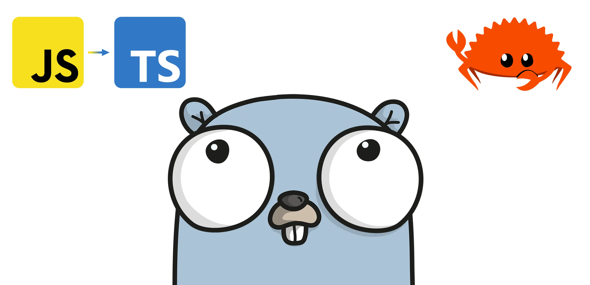

# Comparing TypeScript, Rust, and Go for Backends



Creating high-performing, scalable, and budget-friendly backends is pretty darn important for today's software. With all the buzz around serverless setups and cloud computing, your choice of programming language can seriously shake things up in how your app runs and what it costs. So, in this guide, we're going to put TypeScript, Rust, and Go under the microscope, checking out how they fare in terms of performance, scalability, and just how much fun they are for developers to work with. The goal? To suss out the pros and cons of each language, so we can pick the best one for our specific backend-building needs. Let's find find that sweet spot between performance, scalability, and cost-efficiency, all while keeping the developer experience great.

## Pros/Cons of TypeScript, Rust, and Go

### TypeScript's Pros/Cons

TypeScript is a handy tool for web app development, especially if we're already a JavaScript pro. However, there are some performance quirks and limitations could make it less ideal for those hefty, complex backends.

* **Pros:**  One of the great things about TypeScript is how it's fairly painless for developers who know their way around JavaScript. With a big and vibrant community, along with a ton of libraries and tools, it's a go-to pick for building web apps. TypeScript doesn't skimp on the modern goodies either, supporting features like async/await, decorators, and interfaces for tackling even the trickiest projects. Plus, it handles small to medium-sized apps like a champ, delivering good performance.

* **Cons:**  Now, the not-so-great part about TypeScript is that it can slow things down a bit due to its type-checking and compilation processes, especially when we're dealing with larger applications. It's a high-level language, so it's not the go-to choice for low-level system programming. And when it comes to mega high-traffic applications, TypeScript might not be our choice if we're after peak performance.

### Rust's Pros/Cons

Rust's a powerhouse for building speedy and rock-solid backends. It's got a learning curve, and you might need to dig a little deeper for resources compared to the bigger language tribes.

* **Pros:**  One of the big wins with Rust is its need-for-speed attitude and efficiency, all while being a memory-saving champ. It's a stickler for strong typing and offers zero-cost abstractions. That's a fancy way of saying it's perfect for the tech wizards crafting low-level system apps that demand top-notch performance. Plus, Rust's about safety, making sure our software stays reliable and secure. It's no slouch in the multitasking game either, which makes it a top pick for apps that juggle lots of tasks at once.

* **Cons:** Rust—it's not the easiest nut to crack, especially if you're not well-versed in system programming. Rust's gang of developers and the stash of libraries and tools isn't as vast as some other languages, so you might have to roll up your sleeves to find solutions. Rust also can be a bit verbose, which might slow down your coding productivity until you become more familiar with it.

### Go's Pros/Cons

Go is seemingly perfect for building super-fast backends that can handle tons of stuff at once. However, it's not all sunshine and rainbows; its simplicity comes at a cost.

* **Pros:**  Go sips on memory like a pro, making it a great choice for crafting high-performance apps. It excellent at handling multiple tasks at once, which is handy for those apps with a lot going on. Plus, Go keeps it simple with it's clean syntax and a handy standard library. Also, highly recommended for medium to large-scale apps, striking a sweet balance between power and user-friendliness.

* **Cons:**  Now, the fine print:  Go is missing features other languages may have.  If you're the tool-hungry type, you might need to look around a bit more.  Also, Go's garbabge collection can slow things down in certain situations, which might not be great for some apps. o .

## Performance

For high-performance backends and serverless applications, Rust and Go are both excellent options, while TypeScript may be better suited for smaller applications or projects that require greater ease of use and familiarity with JavaScript.

### TypeScript's Performance

Many dig **TypeScript** because it's easy to use if you are familiar with JavaScript.  But here's the deal when it comes to speed: TypeScript might not be the fastest horse in the race. It gets converted into JavaScript, and that extra translation work can slow things down a smidge due to the type-checking and compilation overhead. The slowdown is usually no big deal, especially for your average-sized apps.

In the following code snippet, we are using TypeScript to calculate the 45th Fibonacci number. The Fibonacci sequence is a series of numbers in which each number is the sum of the two preceding numbers. The first two numbers in the sequence are 0 and 1, and each subsequent number is the sum of the two preceding numbers. The 45th Fibonacci number is 1,134,903,170. In this code snippet, we are using recursion to calculate the 45th Fibonacci number. Just a heads up, depending on your computer's horsepower, this snippet might take up to 15 seconds to finish its job. If you're using a slower computer, it might take even longer.

```TypeScript
function fibonacci(n: number): number {
  if (n < 2) {
    return n;
  }
  return fibonacci(n - 1) + fibonacci(n - 2);
}

const result = fibonacci(45);
console.log(result);
```

### Rust's Performance

**Rust** is all about being lightning-fast and staying safe when it comes to system programming. The secret sauce behind its performance? It's got zero-cost abstractions and high-level control over system resources.  When you've got a need for speed, especially in serverless functions where you want things to be as performant as possible, Rust seems like a logical choice.

As an example, using Rust, we can calculate the 45th Fibonacci number in as little as 10 seconds.

```rust
fn fibonacci(n: u32) -> u32 {
    if n < 2 {
        return n;
    }
    fibonacci(n - 1) + fibonacci(n - 2)
}

fn main() {
    let result = fibonacci(45);
    println!("{}", result);
}
```

### Go's Performance

Performance-wise, Go is a star player, thanks to its speedy compilation and prioritization on concurrency game. As a result, Go is starting to become a popular choice for building high-performance serverless applications, thanks to its low memory footprint and fast execution speed.

Using Go, we can calculate the 45th Fibonacci number in approximately 5 seconds.

```go
package main

import "fmt"

func fibonacci(n int) int {
    if n < 2 {
        return n
    }
    return fibonacci(n-1) + fibonacci(n-2)
}

func main() {
    result := fibonacci(45)
    fmt.Println(result)
}
```

Wait, isn't Rust supposed to be faster than Go?  Rust's ownership model ensures memory safety without the need for garbage collection, which can sometimes lead to better performance in scenarios where memory management is critical. However, the Rust implementation of the Fibonacci function uses a naive recursive algorithm, which can lead to a large number of stack frames being allocated.  In contrast, Go's garbage collector is highly optimized and can perform concurrent garbage collection, which can help manage the memory usage of the Fibonacci function.  In this particular scenario, the garbage collector in Go help manage the memory usage of the Fibonacci function more efficiently than Rust's ownership model, leading to better performance.

For a deeper analysis of their performance, there is an entertaining and informative [video on YouTube that compares TypeScript, Rust, and Go](https://youtu.be/Z0GX2mTUtfo) I suggest you to view if you are interested in learning more.

## Developer Experience

TypeScript, Rust, and Go are also known for providing a great developer experience, with features that can make it easier and more enjoyable for developers to write and maintain code. However, there are also potential challenges and drawbacks that developers may face when working with these languages.:

* **TypeScript** has a strong focus on developer productivity, with features like optional chaining and nullish coalescing that can make code more concise and readable.  However:

    - Type annotations can add complexity and verbosity to the code, especially for simple or small-scale projects.  For example: `const add = (a: number, b: number): number => a + b;` versus `const add = (a, b) => a + b;`
    - The learning curve for TypeScript can be steeper than for other languages, especially for developers who are not already familiar with JavaScript.
    - Code editors and other development tools may require additional configuration to work properly with TypeScript, which can be time-consuming.

* **Rust** has a focus on performance and efficiency, with low-level control over system resources and efficient memory management. However:
    - Rust's strong type system and [borrow checker](https://doc.rust-lang.org/beta/rust-by-example/scope/borrow.html) can be challenging for developers who are not used to working with memory-safe languages, especially when dealing with complex data structures or concurrency.
    - The syntax and language features in Rust can be more complex and verbose than in other languages, which can make it harder for some developers to learn and write code.
    - The [Rust compiler can be slower than some other languages](https://stackoverflow.com/questions/37362640/why-does-rust-compile-a-simple-program-5-10-times-slower-than-gcc-clang), especially when dealing with large codebases or complex projects.

* **Go** has a focus on performance and concurrency, with lightweight threads and efficient memory management. However:

    - Go's focus on simplicity and minimalism can make it less expressive than some other languages, which can make some code less elegant and harder to read.
    - Go's type system can be less flexible than other languages, which can be limiting for some projects.
    - Go's tooling and package management system can be less user-friendly than other languages, especially for developers who are used to more sophisticated tools and frameworks.

## Conclusion

Picking the right programming language is like choosing the right tool for the job when it comes to building top-notch, scalable, and budget-friendly backends. In this discussion, we've given TypeScript, Rust, and Go a look, discussing their performance and how much fun they bring to the developer's table in the world of backends and serverless apps.  Each of these languages has their own perks. Go, with its speedy, low-memory usage, might be the hero your backend project needs. But don't count out Rust and TypeScript – they're can handle the job just fine.

In the end, it's all about finding that perfect fit for your specific project. Whether you're rolling with Go, Rust, or TypeScript, you're in good hands. 🚀

Why didn't I discuss Python, C#, Java, Ruby, or Elixir here?  Find out in my [functional-versus-oop](./functional-versus-oop.md) discussion.
