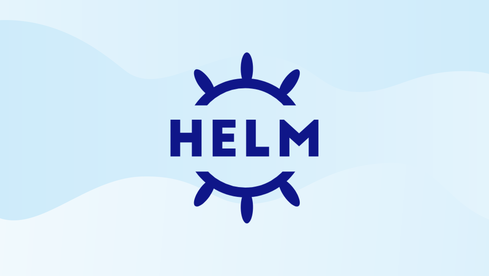

# The Case for Helm Charts Over DevSpace/Loft



[**DevSpace**](https://www.devspace.sh/) and [**Loft**](https://loft.sh/) are both tools designed to simplify the development and deployment of applications on [**Kubernetes**](https://kubernetes.io/). Both tools provide features such as local development environments, simplified deployment workflows, and streamlined debugging and logging. However, they have some differences in their approach and feature sets. **DevSpace** is more focused on providing an end-to-end development workflow, while **Loft** emphasizes multi-tenancy and collaboration features for teams.

Many of the features that DevSpace/Loft provides can be achieved by a more cost-effective approach: just by packaging and deploying Helm charts as normal.

## Pre-requisites

- [Helm](#helm)
- [Kind](#kind)
- [Open Lens](#open-lens)

### Helm

**Helm** is a package manager for Kubernetes that allows you to package and deploy Kubernetes applications. Helm charts are a collection of files that describe a related set of Kubernetes resources. Helm charts can be used to deploy applications, but they can also be used to deploy other types of Kubernetes resources which are out of scope for this article.

To install Helm, follow the instructons for your OS on the [Helm website](https://helm.sh/docs/intro/install/). Once Helm is installed, you can verify that it is working by running the following command:

```bash
helm version
```

Helm charts are stored in a Helm chart repository, which is a collection of Helm charts. Helm chart repositories can be hosted on a public or private server, or they can be hosted on a cloud storage service, such as Amazon S3 or Google Cloud Storage. Helm chart repositories can be accessed using the Helm CLI, which can be installed using the following command:

```bash
curl https://raw.githubusercontent.com/helm/helm/master/scripts/get-helm-3 | bash
```

Once the Helm CLI is installed, you can add a Helm chart repository using the following command, for example:

```bash
helm repo add stable https://kubernetes-charts.storage.googleapis.com/
helm repo add bitnami https://charts.bitnami.com/bitnami
helm repo add janpreet https://janpreet.github.io/helm-charts/
helm repo update
```

Once a Helm chart repository has been added, you can search for Helm charts using the following command:

```bash
helm search repo stable

# Once you've found a Helm chart that you want to install, you can install it using the following command:
helm install stable/mysql  
```

We installed the MySQL Helm chart just for demonstration purposes.  We will not be using it in this tutorial.

### Kind

[Kind](https://kind.sigs.k8s.io/) is a tool for running local Kubernetes clusters using Docker container "nodes". Kind was primarily designed for testing Kubernetes itself, but it can also be used for local development or CI.  Alternatives to Kind include Minikube, K3s, and MicroK8s.  However, Kind is the most popular option for local development due to its speed, ease of use, and it's ability to offer a local container registry (not in scope of this article).

To install Kind, follow the instructions for your OS on the [Kind website](https://kind.sigs.k8s.io/docs/user/quick-start/#installation). Once Kind is installed, you can verify that it is working by running the following command:

```bash
kind version
```

Using namespaces is useful when you need to logically separate workloads within a single cluster, but still want to share resources such as nodes and network infrastructure. Namespace-level resource quotas can also be applied to prevent any one workload from using up too much of the shared resources.

While Kubernetes namespaces are used to isolate workloads and resources within a single cluster, creating separate clusters with tools like Kind creates isolated environments with their own Kubernetes API server, etcd storage, and worker nodes. Each cluster can have its own configuration, resource allocation, and security settings. Separate clusters are also useful when you need to create isolated environments for different purposes, such as development, testing, or production. Each cluster can have its own resources and configurations, making it easier to manage and isolate workloads.

With that said, let's create a namespace and cluster with the `kubectl` command.  `kubectl` is typically installed together with kind and minikube since it is a necessary command-line tool for interacting with Kubernetes clusters.  To create a these resources, run the following commands:

```bash
# To isolate our tutorial application from other workloads, we'll create a separate Kind cluster
kind create cluster --name tutorial-cluster
kubectl config use-context kind-tutorial-cluster # switch to the kind cluster

# create a namespace for all resources for our tutorial application
# i.e., frontend, backend, database, etc.
kubectl create namespace tutorial-app
```

### Open Lens

OpenLens is an open-source project that provides a single dashboard to manage and monitor multiple Kubernetes clusters. It offers a graphical user interface that allows users to easily visualize and manage their resources. OpenLens supports a variety of Kubernetes distributions and is available for free.

For more information about OpenLens, read this [blog post](https://www.virtualizationhowto.com/2022/11/openlens-kubernetes-ide-opensource-lens-desktop/) and installation instructions from the [OpenLens website](https://k8slens.dev/desktop.html).

## Our Tutorial Application

For this tutorial, we'll be using a simple Node.js application and "Dockerize" it. We can create this application by running the following commands:

```bash
mkdir tutorial-app && cd $_

echo "const http = require('http');

const hostname = '0.0.0.0';
const port = process.env.PORT || 3000;

const server = http.createServer((req, res) => {
  res.statusCode = 200;
  res.setHeader('Content-Type', 'text/plain');
  res.end('Hello, world!\n');
});

server.listen(port, hostname, () => {
  console.log(\`Server running at http://\${hostname}:\${port}/\`);
});" >| app.js

echo 'FROM node:18-alpine

WORKDIR /app

COPY . .

EXPOSE 3000

CMD [ "node", "app.js" ]' >| Dockerfile
```

Subsequently, let's build and push our image to the Docker container registry. We can do this by running the following commands:

```bash
docker login # Login to Docker Hub
docker build . -t <our Docker user name>/tutorial-app
docker push <our Docker user name>/tutorial-app
```

Next, let's create a Helm chart for our application. We can do this by executing:

```bash
helm create tutorial-app

# Replace the values.yml file with the following:
export our_DOCKER_USER_NAME=<our Docker user name>
sed -i "s/repository: nginx/repository: ${our_DOCKER_USER_NAME}\/tutorial-app/g" tutorial-app/values.yaml
sed -i 's/port: 80/port: 3000/g' tutorial-app/values.yaml

# Replace the deployment.yml file with the following:
export our_DOCKER_USER_NAME=<our Docker user name>
echo "apiVersion: apps/v1
kind: Deployment
metadata:
  name: tutorial-app
spec:
  replicas: 1
  selector:
    matchLabels:
      app: tutorial-app
  template:
    metadata:
      labels:
        app: tutorial-app
    spec:
      containers:
      - name: tutorial-app
        image: ${our_DOCKER_USER_NAME}/tutorial-app
        ports:
        - containerPort: 3000" >| tutorial-app/templates/deployment.yaml
```

Lets deploy our Helm chart to the cluster:

```bash
helm install tutorial-app ./tutorial-app  --namespace tutorial-app # install the chart into the tutorial-app namespace
```

Deployment to the Kubernetes cluster is done. We can verify this by running the following command:

```bash
kubectl get pods --namespace tutorial-app
```

For security reasons, the port of our application isn't forwarded.  To forward the port of our application, run the following:

```bash
kubectl port-forward deployment/tutorial-app 3000:3000 --namespace tutorial-app &
curl localhost:3000  #  you should see "Hello, world!"
```

To view this all in Open Lens, click the blue button representing cluster catalogs in the upper left corner of the Open Lens UI.  Then hen select the `kind-tutorial-cluster` to connect to it.  After connected, select `Deployments` in the new left sidebar. You should see the `tutorial-app` deployment. This will open a new dialog on the right-hand side of the UI. Within this new dialog, scroll to the "3000/TCP" clickable link. You should see the `Hello, world!` message open within your defaut web browser.

### Troubleshooting

If you have issues with steps in this tutorial, scorth earth and subsequently start over. We can do this by running the following commands:

```bash
kubectl delete namespace tutorial-app
kind delete cluster --name tutorial-cluster

kubectl create namespace tutorial-app
kind create cluster --name tutorial-cluster

docker build -t <our Docker user name>/tutorial-app .
docker push <our Docker user name>/tutorial-app

helm install tutorial-app ./tutorial-app  --namespace tutorial-app
```

For remote clusters, I suggest using GitHub Actions to automate the deployment process.  We can use a GitHub Action to build and push a Docker image to the GitHub Container Registry (GHCR).  When we push to the GHCR, we can set it to automatically generate a webhook event that we can use to trigger actions in other systems.  For example, we can configure our deployment controller to periodically check the container registry for new versions of the image, or set up a webhook to trigger a deployment update whenever a new image is pushed to the registry.

Another option is to use a continuous deployment tool like Flux or Argo CD, which can monitor our container registry and automatically update our Kubernetes cluster when new images are available. These tools can also help us manage the deployment process, automate rollbacks, and provide other useful features for managing our clusters.

For more information on how this can be set up with Amazon's Elastic Kubernetes Service (EKS), see this [article](https://www.learnaws.org/2021/06/25/eks-github-ci/) and this [repository](https://github.com/aws-samples/eks-blueprints-actions-workflow).

Installing a Helm chart can be a one-time task with subsequent upgrades. My suggestion would be to create a separate repository for all Helm charts within our organization. It may not be as flashy as Loft, but it's a workable idea. We can have a repository for all our Helm charts, and we can use Flux or Argo CD to deploy them to our clusters. We can also use Flux or Argo CD to deploy our application manifests to our clusters. Since it's in a repository, we can have a subset of our team responsible for maintaining the Helm charts and application manifests. This way, we can have a separation of concerns between the developers who are less experienced in DevOps and others who are more experienced. These more "DevOps"-y engineers can be responsible for code reviews when pull requests are opened for this repository.

## Automatic application deployment

DevSpace/Loft provides a feature that automatically deploys our application to a Kubernetes cluster whenever you make changes to our code. You can achieve this same functionality using Helm by using a CI/CD pipeline that automatically builds and deploys our Helm chart whenever changes are pushed to our source code repository.

To achieve similar functionality to DevSpace's auto-deploy feature using Helm, you can set up a CI/CD pipeline that builds and deploys our Helm chart whenever changes are pushed to our source code repository. As mentioned earlier, we can use a continuous integration tool like GitHub Actions to build and push our Docker image to a container registry, and then use a continuous deployment tool like Flux or ArgoCD to automatically deploy our Helm chart to our Kubernetes cluster.

## Local development environment

DevSpace/Loft allows you to run a local development environment that mirrors the configuration of our production environment.

Helm alone does not provide a way to create a local development environment that mirrors the production environment. However, we can achieve this same functionality wehen we deploy our application to a local Kubernetes cluster, such as Kind or Minikube, which can serve as a local development environment.  Using only Helm and a local Kubernetes cluster can be a more cost-effective approach than using additional tools like DevSpace or Loft.  Helm provides a simple and effective way to package, deploy, and manage applications on a Kubernetes cluster, while a local Kubernetes cluster like Minikube can provide a low-cost way to test and develop our application locally before deploying to a production environment.

## Debugging and logging

DevSpace/Loft provides features that allow you to easily debug and view logs from our application running in a Kubernetes cluster.

Helm does not provide specific features for debugging or logging.  However, we can achieve this same functionality for our Helm-deployed applications by using Kubernetes logging and debugging tools, such as `kubectl logs`, Open Lens, or [Kubernetes Dashboard](https://www.virtualizationhowto.com/2021/06/kubernetes-dashboard-helm-installation-and-configuration/).

Using OpenLens, we can view the logs for our application by selecting the `kind-tutorial-cluster` cluster, and then selecting `Pods` in the sidebar.  We can then select the `tutorial-app*` pod, and then click on the `Logs` button in the dialog's upper toolbar.

## Application scaling

DevSpace/Loft provides features that allow you to easily scale our application running in a Kubernetes cluster.

We can achieve similar functionality as DevSpace/Loft for scaling our application in a Kubernetes cluster by using Helm. You can modify the `replicaCount` and `resources` fields in the **values.yaml** file to specify the desired number of replicas and resource requirements for our application.

```yaml
replicaCount: 3

resources:
  limits:
    cpu: "1"
    memory: "1Gi"
  requests:
    cpu: "500m"
    memory: "256Mi"
```

Then, when we install or upgrade our Helm chart using `helm install` or `helm upgrade` commands, the **Kubernetes Deployment** object that is created will have the desired number of replicas and resource requirements set according to the values specified in the `values.yaml` file.

