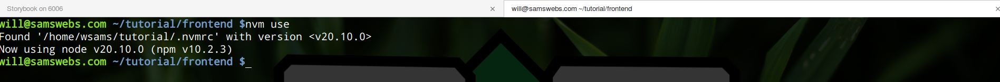
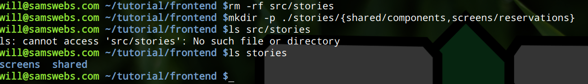
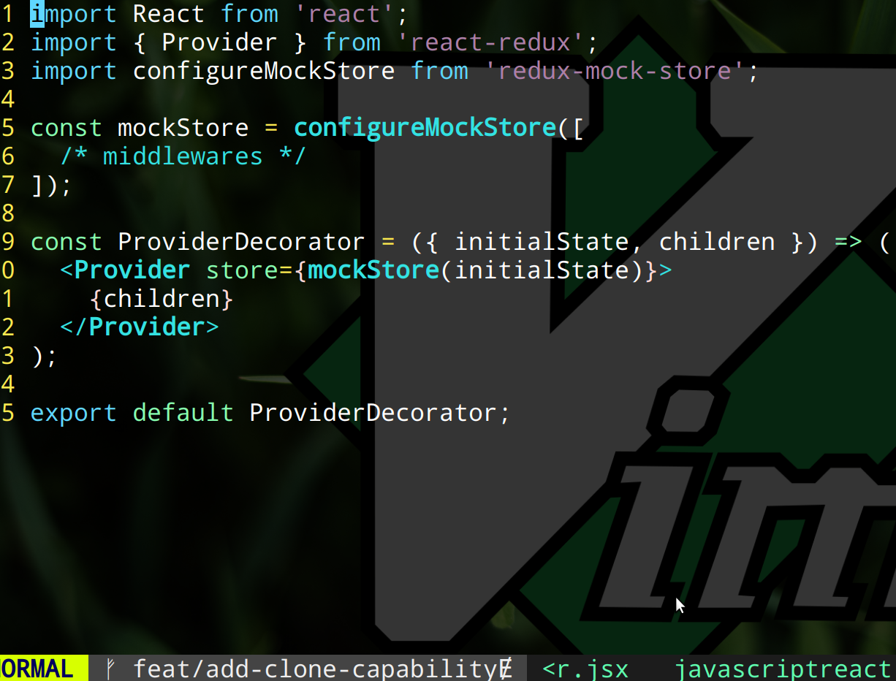

# Using Storybook To Drive Development

This is a script to help guide you through the process of driving development in a React/Redux application.  The goal of this tutorial is help you get a feel for the process of implementing a new feature in a React+Redux application based on the conventions used in this codebase.

The feature we'll be providing the abilitly to clone a hotel reservation.  The instructions are written in a way that assumes you are using a Unix-based system.  If you are using Windows, please use [WSL](https://learn.microsoft.com/en-us/windows/wsl/about), [Git Bash](https://gitforwindows.org/), or [Msys2](https://www.msys2.org/).  **For the path of least resistance, I recommend WSL.**

## TOC

* [Add Storybook](#1---add-storybook)
* [Get Acquanted With the Codebase](#2---get-acquanted-with-the-codebase)
* [Implement a New Feature](#3---implement-a-new-feature)
  * [Begin Implementing the CloneReservation Screen Component](#3a---begin-implementing-the-clonereservation-screen-component)
    * [Write a Test for the Screen Component](#3ai---write-a-test-for-the-screen-component)
    * [Create a "Loading" Story](#3aii---create-a-loading-story)
  * [Connect the Screen Component to the Global State](#3b---connect-the-screen-component-to-the-global-state)
  * [Begin Implementing the copyReservation Saga](#3c---begin-implementing-the-copyreservation-saga)
    * [Write a Test for the Saga](#3ci---write-a-test-for-the-saga)
    * [Create the "Loaded" Story](#3cii---create-the-loaded-story)
* [Conclusion](#conclusion)

## 1 - Add Storybook

First, let's add [Storybook](https://storybook.js.org/) to the project.  Storybook is a tool for developing UI components in isolation, so it's perfect for developing new features and components in isolation.  It's also a great way to get familiar with the codebase.  We'll add it to the frontend of the application.

```bash
git clone git@github.com:WillSams/example-js-react-with-python.git tutorial
cd tutorial/frontend

# if you are using nvm
nvm use  

# since we are doing multiple stories for a feature, create 
# a new branch for feature development
git checkout -b feat/add-clone-capability  

npx --yes -p @storybook/cli sb init --type react
# NOTE:  when prompted, say "no" to more no to more eslint rules
```


It will probably take a while to install all of the dependencies + Storbook.  It should be up & running when it's done.


Since Storybook is now occupying the terminal window we were using, let's open a new terminal window and navigate to the frontend directory:



By default, the Storybook installation added a **stories** folder in our `/frontend/src/` folder.  Let's get rid of it and recreate it in  in `/frontend/`:

```bash
# assuming you are still in the frontend directory
rm -rf src/stories
mkdir -p ./stories/{shared/components,screens/reservations}
```



Now let's replace line 3 in stories/main.js.  I'm going to use `sed` to do this, but you can use your code editor if you'd like.

```bash
sed -i '3d' .storybook/main.js
sed -i '3i\  stories: ["../stories/**/*.stories.@(js|jsx)"],' .storybook/main.js
```


Let's add our application's styling as well:

```bash
sed -i '4i\  staticDirs: ["../public"],' .storybook/main.js
sed -i '2i\import "../public/css/application.css"' .storybook/preview.js
```


## 2 - Get Acquanted With the Codebase

Let's write our first story.  To get better acquainted with some of the conventions of the codebase while also getting Storybook involved, let's write a story for an existing component:  the `AlertModal`.  This component is used to display alerts to the user.  It's used in a few places in the codebase, so it's a good place to start.

```bash
# Note: I'm using the `echo` command to write to a file.  You can use your code editor if you'd like.
# Also note that I'm using the `>` operator to write to a file.  This will overwrite the file if it already exists. If you want to append to a file, use `>>` instead of `>`.
# Finally, I should address my usage of double quotes in the code below.  When using `echo` this way, at times in this article I'll wrap the text in single-quotes to avoid an issue where I'll need to escape a character other-wise.  The Prettier formatter will change the inner double quotes to single quotes when it formats the code.  I just want to make sure you're aware of this because it will be inconsistent in the article.
echo 'import AlertModal from "@/shared/components/AlertModal";

export default { title: "AlertModal", component: AlertModal };

export const Default = {
  args: {
    message: "This has a Success title.",
    onClose: () => {},
  },
};

export const Success = {
  args: {
    message: "This has a Success title.",
    onClose: () => {},
  },
};

export const Danger = {
  args: {
    message: "This has an Error title.",
    onClose: () => {},
  },
};' >| stories/shared/components/AlertModal.stories.jsx
```


Since this is an existing component, a unit test already exists, i.e., [/frontend/specs/shared/components/AlertModal.spec.jsx](https://github.com/WillSams/example-js-react-with-python/blob/main/frontend/specs/shared/components/AlertModal.spec.jsx).  I suggest reviewing the test to learn the style of the tests within this codebase.  With that said, writing stories should help inform what tested, so keep that in mind as you go through this example.

## 3 - Implement a New Feature

### 3a - Begin Implementing the CloneReservation Screen Component

Let's start by creating a new component for the reservations/clone screen.

```bash
echo 'import React from "react";
const CloneReservationComponent = () => {
  return (
    <>
      <span>This is the CloneReservationComponent</span>
    </>
  );
};

export default CloneReservationComponent;' >| src/screens/reservations/clone.jsx
```


#### 3ai - Write a Test for the Screen Component

We'll use the test to also help drive the development of the component.  First we'll write a test that will fail, then we'll modify the component to make the test pass.

```bash
echo "import { screen } from '@testing-library/react';

import React from 'react';

import { initialState as defaultShared } from '@/shared/sharedReducer';
import CloneReservationComponent from '@/screens/reservations/clone';

import { render } from '../../reactTestHelpers';

describe('CloneReservationComponent', () => {
  it('should render component', async () => {
    const pathname = '/reservations/clone';
    const initialEntries = [pathname];
    const initialState = { };
    const ui = <CloneReservationComponent />;
    render(ui, { initialState, initialEntries });

    expect(screen.getByText(/This text does not exist on page/i)).toBeInTheDocument();
  });
});" >| specs/screens/reservations/clone.spec.jsx
```


Now let's run the test to see it fail.  We'll create an alias for Jest to make it easier to run the test.

```bash
alias jest=./node_modules/jest/bin/jest.js
jest specs/screens/reservations/clone.spec.jsx  # test should fail
```


Now let's make it pass by modifying the component:

```bash
sed -i 's/This text does not exist on page/This is the CloneReservationComponent/' specs/screens/reservations/clone.spec.jsx
jest specs/screens/reservations/clone.spec.jsx  # test should now pass
```


Before we move on, let's commit our changes:

```bash
git add .
git commit -m "Create CloneReservationComponent"
```


#### 3aii - Create a "Loading" Story

That heading is a bit misleading.  We're actually going to write two stories to help us design the UI:  `Default` and `Loading`. `Default` is self explanatory, but `Loading` is a bit more interesting.  We'll use the `Loading` story to expose the state management we'll need to do.  With that said, let's add a useful helper for composing our stories with [Redux](https://redux.js.org/) state management, which is used in this codebase.  We'll use the `Provider` component from `react-redux` to wrap our component with a Redux store.  We'll also use `redux-mock-store` to create a mock store to pass to the `Provider` component.  We'll create a file called `ProviderDecorator.jsx` in the `.storybook` directory to help us do this:

```bash
echo "import React from 'react';
import { Provider } from 'react-redux';
import configureMockStore from 'redux-mock-store';

const mockStore = configureMockStore([
  /* middlewares */
]);

const ProviderDecorator = ({ initialState, children}) => (
  <Provider store={mockStore(initialState)}>{children}</Provider>
);

export default ProviderDecorator;" >| .storybook/ProviderDecorator.jsx
```



Now let's write our a story to help us build out our component:

```bash
echo "import CloneReservationComponent from '@/screens/reservations/clone';

import { initialState as defaultShared } from '@/shared/sharedReducer';

import ProviderDecorator from '../../../.storybook/ProviderDecorator';

const initialState = {
  shared: { ...defaultShared },
  router: { location: { pathname: '/reservations/clone' } },
  site: {
    reservations: {
      cloneReservation: {
        loading: false,
        reservation_id: 999,
      },
    },
  },
};

export default {
  component: CloneReservationComponent,
  title: 'CloneReservationComponent',
  decorators: [(story) => <>{story()}</>],
};

export const Default = {
  decorators: [
    (story) => (
      <ProviderDecorator initialState={initialState} children={story()} />
    ),
  ],
};

const loadingState = {
  ...initialState,
  site: {
    reservations: {
      cloneReservation: {
        loading: true,
        reservation_id: 999,
      },
    },
  },
};
export const Loading = {
  decorators: [
    (story) => (
      <ProviderDecorator initialState={loadingState} children={story()} />
    ),
  ],
};" >| stories/screens/reservations/clone.stories.jsx
```

**todo** insert pic here - the story listed above

**todo** insert pic here - the storybook screen re-iterating the below statement

Looking at Storybook, the visual look of `Default` and `Loading` look the same.  Let's start by modifying the UI of the component to design what it should look like.

We'll begin this by writing a test to ensure that the loading state is being handled.  We'll modify the original test to pass and the second test
to fail (NOTE: cheating here for brevity of this example, we should normally focus on one test at a time):

```bash
echo "import { screen } from '@testing-library/react';

import React from 'react';

import { initialState as defaultShared } from '@/shared/sharedReducer';
import { Loading } from '@/shared/components';
import CloneReservationComponent from '@/screens/reservations/clone';

import { render } from '../../reactTestHelpers';

describe('CloneReservationComponent', () => {
  it('should render component once loaded', async () => {
    const pathname = '/reservations/clones';
    const initialEntries = [pathname];
    const initialState = {
      shared: { ...defaultShared },
      router: { location: { pathname } },
      site: {
        reservations: {
          cloneReservation: {
            loading: false,
            reservationId: 999,
          },
        },
      },
    };

    const ui = <CloneReservationComponent />;
    render(ui, { initialState, initialEntries });

    expect(
      screen.getByText(/This is the CloneReservationComponent/i),
    ).toBeInTheDocument();
  });

  it('should render loading animation if screen is loading', async () => {
    const pathname = '/reservations/clones';
    const initialEntries = [pathname];
    const initialState = {
      shared: { ...defaultShared },
      router: { location: { pathname } },
      site: {
        reservations: {
          cloneReservation: {
            loading: true,
            reservationId: 999,
          },
        },
      },
    };

    const ui = (
      <div>
        <CloneReservationComponent />
      </div>
    );

    render(ui, { initialState, initialEntries });

    const image = screen.getByAltText('Loading'); // Adjust this selector based on how you've set up the alt text
    expect(image).toBeInTheDocument();
    expect(image.src).toContain('/img/loading.gif');
  });
});" >| specs/screens/reservations/clone.spec.jsx
```

**todo** insert pic here

```bash
jest specs/screens/reservations/clone.spec.jsx  # test fails
```

**todo** insert pic here

Now let's modify the CloneReservation component to handle the loading state...:

```bash
echo "import React from 'react';

import { useSelector } from 'react-redux';
import { Loading } from '@/shared/components';

const CloneReservationComponent = () => {
  const loading = useSelector(state => state?.site?.reservations?.cloneReservation?.loading);
  return (
    <>
      {loading && (<Loading />)}
      {!loading && (<span>This is the CloneReservationComponent</span>)}  
    </>
  );
};

export default CloneReservationComponent;" >| src/screens/reservations/clone.jsx
```

**todo** insert pic here

...and to pass our test:

```bash
jest specs/screens/reservations/clone.spec.jsx  # test passes
```

**todo** insert pic here

## 3b - Connect the Screen Component to the Global State

Great!  Now let's use [Redux-Saga](https://redux-saga.js.org/) to load the reservation data.  Why do I use Redux+Sagas?  It's a good way to handle side effects in Redux. Instead of using Redux, I find using [Jotai](https://jotai.org/) or [Recoil](https://recoiljs.org/) to be a bit more straightforward.  However, the conventions (i.e., the `connectComponent` and `createComponentReducer` behaviors, plus the `actionCreators` object) used in this codebase is a great way to avoid *some* of the complexity of Redux.  This is how I originally learned to do global state management in React, and it still resonates with me.
  
```bash
sed -e "/GET_RESERVATION: 'site\/reservations\/show\/GET_RESERVATION',/r"<(
echo "
LOAD_CLONE_RESERVATION_COMPONENT:
'site/reservations/clone/LOAD_CLONE_RESERVATION_COMPONENT',
  LOAD_CLONE_RESERVATION_COMPONENT_SUCCESS:
    'site/reservations/clone/LOAD_CLONE_RESERVATION_COMPONENT_SUCCESS',
  LOAD_CLONE_RESERVATION_COMPONENT_FAILED:
    'site/reservations/clone/LOAD_CLONE_RESERVATION_COMPONENT_SUCCESS',

  UNLOAD_CLONE_RESERVATION_COMPONENT:
    'site/reservations/clone/UNLOAD_CLONE_RESERVATION_COMPONENT',
  UNLOAD_CLONE_RESERVATION_COMPONENT_SUCCESS:
    'site/reservations/clone/UNLOAD_CLONE_RESERVATION_COMPONENT_SUCCESS',
  UNLOAD_CLONE_RESERVATION_COMPONENT_FAILED:
    'site/reservations/clone/UNLOAD_CLONE_RESERVATION_COMPONENT_SUCCESS',

  CLONE_RESERVATION_COMPONENT: 'site/reservations/CLONE_RESERVATION_COMPONENT',
  COPY_RESERVATION: 'site/reservations/clone/COPY_RESERVATION',"
  ) -i -- src/shared/base/actionCreators.js
```

Next, the reducer.  We'll create a new file for it and add it to the **reservations screen reducer** file and the main **screens reducer** file:
  
```bash
echo "import { actionCreators, createComponentReducer } from '@/shared/base';

const initialState = {
  loading: true,
};

const actionHandlers = {};
const reducer = createComponentReducer(
  actionCreators.CLONE_RESERVATION_COMPONENT,
  initialState,
  actionHandlers,
);

export { reducer };" >| src/screens/reservations/reducers/clone.js

echo "import { reducer as cloneReducer } from './clone';
import { reducer as editReducer } from './edit';
import { reducer as newReducer } from './new';
import { reducer as showReducer } from './show';

export { cloneReducer, editReducer, newReducer, showReducer };" >| src/screens/reservations/reducers/index.js

echo "import { combineReducers } from 'redux';

import { homeReducer } from './home/reducers';
import { cloneReducer, newReducer, showReducer, editReducer } from './reservations/reducers';

const siteReducer = combineReducers({
  home: homeReducer,
  newReservation: newReducer,
  showReservations: showReducer,
  editReservations: editReducer,
  cloneReservation: cloneReducer,
});

export default siteReducer;" >| src/screens/reducer.js
```

**todo** insert pic here - with 3 panes in Vim showing each file

Finally, let's connect our clone reservation screen component to the frontend client's global state:

```bash
echo 'import { default as HomeComponent } from './home';
import { default as EditReservationComponent } from './reservations/edit';
import { default as NewReservationComponent } from './reservations/new';
import { default as ShowReservationComponent } from './reservations/show';
import { default as CloneReservationComponent } from './reservations/clone';

export default {
  HomeComponent,
  CloneReservationComponent,
  EditReservationComponent,
  NewReservationComponent,
  ShowReservationComponent,
};' >| src/screens/index.js

echo "import React from 'react';

import { useSelector } from 'react-redux';
import { Loading } from '@/shared/components';

const CloneReservationComponent = () => {
  const loading = useSelector(state => state?.site?.reservations?.cloneReservation?.loading);
  return (
    <>
      {loading && (<Loading />)}
      {!loading && (<span>This is the CloneReservationComponent</span>)}  
    </>
  );
};

const screen = connectComponent(CloneReservationComponent, {
  componentName: actionCreators.CLONE_RESERVATION_COMPONENT,
  state: (state) => state?.site?.newReservations?.reservation,
  load: {
    reservation: () => ({ type: actionCreators.GET_RESERVATION }),
  },
  dispatch: (dispatch) => ({
    createReservation: (reservationId) =>
      dispatch({ type: actionCreators.CLONE_RESERVATION, reservationId }),
  }),
});

export default screen;" >| src/screens/reservations/clone.jsx
```

**todo** insert pic here - with 2 panes in Vim showing each file

The original tests should still pass

```bash
jest specs/screens/reservations/clone.spec.jsx 
```

### 3c - Begin Implementing the copyReservation Saga

#### 3ci - Write a Test for the Saga

#### 3cii - Create the "Loaded" Story

Now let's write our next story, test it, a

## Conclusion

I hope that give some clarity to the process of implementing a new feature in a React/Redux application, especially in regards to the conventions used in this codebase and for my other examples on [GitHub](https://github.com/WillSams).  If you have any questions, please feel free to reach out to me via [email](mailto://will@samswebs.com).  Thanks for reading!

